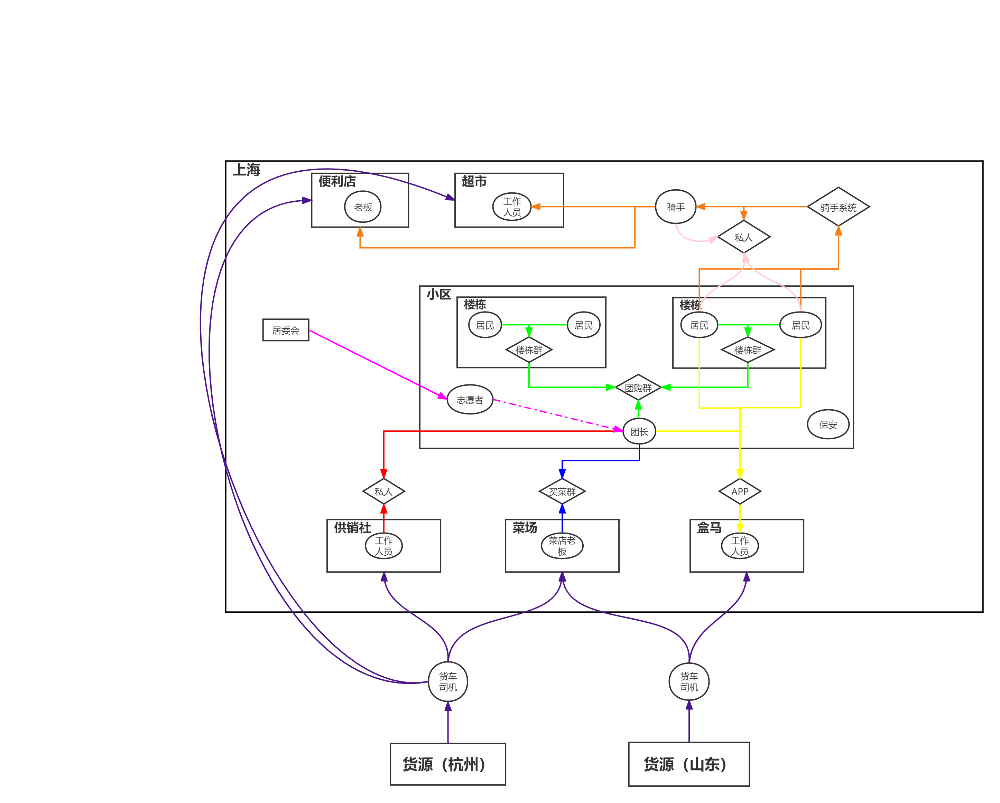

### 前言

四月已经过去了二十多天。自3月31日上海宣布全域静态管理以来，上海出现了大量的荒诞、丑恶、绝望的事件。在度过最初的震惊和悲伤之后，我们自然而然地会发出质问：**上海为什么会这样？我们怎么避免上海的悲剧再次发生？**回答这些问题需要从多个角度出发，经过**现场重组**，**微观分析**，**宏观推演**等层层递进的步骤。如此才能为我们揭示上海防疫悲剧体现的**客观规律**，从而作出科学理性的决策。因此，本文聚焦现场重组这一步骤，采用**整理文字记录**的方法，力图清晰地总结出这二十多天以来，物资从货源地到居民手上的每一个环节，都在发生什么。本文认为对**物资运输**的现场重组是分析上海现状至关重要的一个步骤，它不仅关系到每个上海居民的生存需求，同时也是后续分析的基石。一切对现场先入为主的错误想象，只能作为构建平行世界的素材。

### 正文

#### 第一节：运输环节

首先需要确定物资运输涉及到多少个环节。我们将**记录**中涉及的**实体**提取出来，并对这些实体进行**分类**。通过对《[疫情之下：一个上海“团长”的自我修养](https://mp.weixin.qq.com/s/6WsT5CcslXBd-wDmGOA1Wg)》、《[上海骑手的15天](https://mp.weixin.qq.com/s/hA8hV60XV2DKaEg9_kl3Ig)》的整理，我们得出了下面四种分类：

- **建筑**：货源（杭州，山东），仓库（菜场，盒马，供销社，便利店，超市），楼栋，小区，居委会
- **组织**：货车司机，供应商（菜店、便利店老板，盒马、供销社、超市工作人员），骑手，团长，志愿者，小区保安，居民，居委会
- **通讯**：团购群，楼栋群，买菜群，APP，骑手系统（顺丰，蜂鸟），私人通讯
- **物资**：蔬菜，肉，大米，调味品，油，鸡蛋，水果，牛奶，尿不湿，面粉，奶粉，药

其中，

- **建筑**指的是物资在运输过程中存放的节点，以货源为起点，以楼栋为终点，简易链条是：货源——>仓库——>小区——>楼栋
- **组织**指的是负责采购、运输和消费物资的组织或个人，简易链条是：货车司机——>供应商——>骑手——>团长、志愿者、小区保安——>居民
- **通讯**指的是组织间交流的工具，主要对应关系有：团购群，楼栋群——居民，团长，志愿者；买菜群——菜店老板，团长；APP——居民，工作人员；骑手系统——居民，骑手；私人通讯——（居民，骑手），（供应商，团长）
- **物资**，顾名思义

根据这四种分类，我们绘制了上海物资运输的流程图，其中物资被省略：

[TODO]

#### 第二节 [TODO]

更多资料：

[下不了高速的货车司机们](https://mp.weixin.qq.com/s/vRXrr2o_ew_ahEomtgc6yA)

[在上海方舱的19个日夜](https://mp.weixin.qq.com/s/_8EeMYE1eZZKO-qcl97YFg)

[我在盒马当司机，才明白在上海送菜到底难在哪](https://mp.weixin.qq.com/s/3qW86520C6Xt8g97_K9lMw)